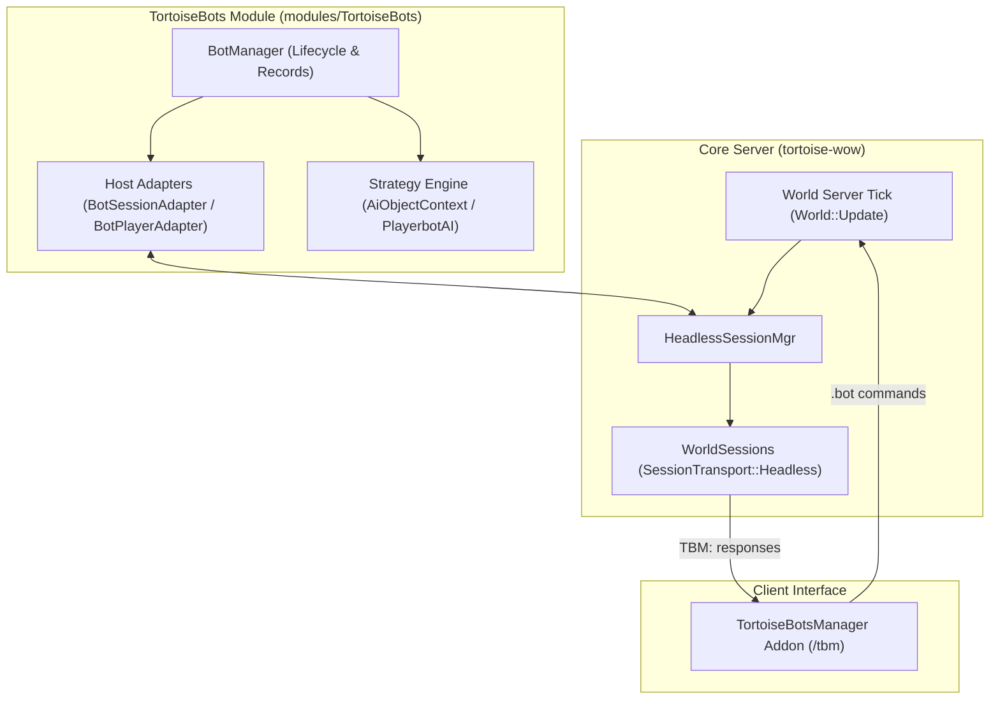

# Architecture Invariants & Core Boundaries

TortoiseBots adheres to strict architectural rules to prevent the severe code coupling that crippled earlier PlayerBots implementations.

## Architectural Boundaries

## The 5 Core Invariants

| Invariant | Architectural Principle | Violations to Prevent | Enforcement Mechanism |
| :--- | :--- | :--- | :--- |
| **1. 100% Modular Native C++** | Module lives entirely in `modules/TortoiseBots/`. | Direct core edits, mandatory module dependencies. | CMake `-DMODULES=disabled` build gate. |
| **2. Zero Core Coupling** | Core server contains zero bot AI or state. | `WorldSession::GetBot()`, `Player::m_bot`, `if (IsBot())`. | `tools/verify_tortoise_surface.sh` audit. |
| **3. Generic Headless Sessions** | Bots use standard `WorldSession` with `SessionTransport::Headless`. | Custom socket subclasses, bypassing network auth. | Headless checks, Human Reclaim protocol. |
| **4. Narrow Host Boundary** | All host interaction passes through explicit adapters in `host/`. | Direct header pollution, leaking module types into core. | `tools/verify_penqle_host_contract.sh`. |
| **5. Asynchronous LLM Isolation** | LLM/Chat reasoning is asynchronous from combat ticks. | Blocking the main world frame for network responses. | Background queue / worker isolation. |

---

### Detailed Invariant Specifications

#### 1. 100% Modular Native C++ Module
The core server ([tortoise-wow](https://github.com/tortoise-wow/tortoise-wow)) must compile cleanly without TortoiseBots enabled (`-DMODULES=disabled` or without `-DMODULE_TORTOISEBOTS=static`). TortoiseBots lives entirely inside `modules/TortoiseBots/`.

#### 2. Zero Core Coupling (No `GetBot()` or `m_bot`)
Never reintroduce direct bot references into core engine code:
* ❌ No `WorldSession::GetBot()` or `Player::m_bot`.
* ❌ No scattered `if (IsBot())` checks in core combat, movement, or spell systems.
* ✅ All bot state, AI decision engines, strategies, and inventories are owned exclusively by the `TortoiseBots` module.

#### 3. Generic Headless Sessions (`SessionTransport::Headless`)
Bot sessions are not special core subclasses. They are standard `WorldSession` instances backed by `SessionTransport::Headless`:
* One account can have at most one Network session + $N$ Headless sessions.
* **Human Reclaim Always Wins:** If a human logs into an account while a bot is active from that account, the bot is cleanly logged out and human control takes precedence immediately.
* Headless sessions never manipulate `LoginDatabase` online account status, preserving normal network authentication boundaries.

#### 4. Narrow, Centralized Host Boundary
All interaction between the module and core server passes through explicit adapters in `host/`:
* `BotSessionAdapter`: Manages headless session allocation and termination via `World::StartHeadlessSession`.
* `BotPacketAdapter`: Handles packet routing and interception.
* `BotPlayerAdapter`: Interacts with standard `Player` objects through native server APIs.

#### 5. Asynchronous LLM Isolation
LLM-based chat interactions are purely asynchronous and decoupled. If an LLM backend times out or fails, combat AI, movement, healing, interrupts, and crowd control continue running with zero interruption or frame hitching.

### Migration scheduler status (2026-09-12)

The ManTech map scheduler consumes generic machine-driven/critical hooks from
BotPlayerAdapter. Human-interest checks inspect network players on the owning
map instance; the random-bot roster is not a human observer list. Classification
is separate from execution ownership: the module's AI loop still executes on
the world owner after maps join. Parallel AI dispatch remains pending a shared
state/lifecycle audit; passing classification tests does not prove concurrency.
