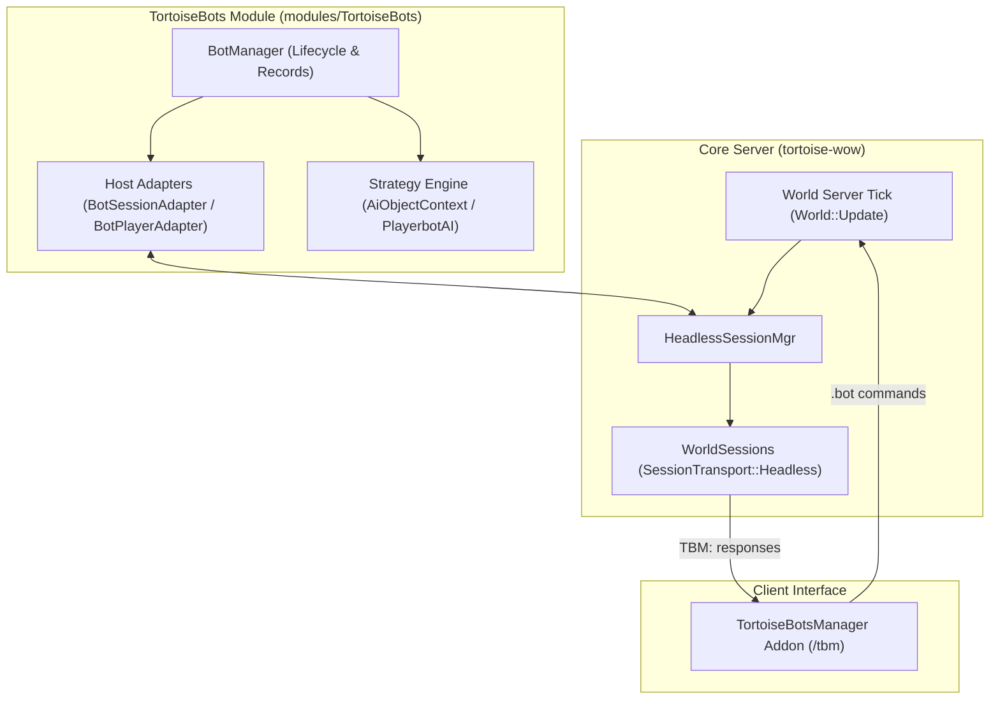

# Architecture Invariants & Core Boundaries

TortoiseBots adheres to strict architectural rules to prevent the severe code coupling that crippled earlier PlayerBots implementations.

## Architectural Boundaries

## The 5 Core Invariants

| Invariant | Architectural Principle | Violations to Prevent | Enforcement Mechanism |
| :--- | :--- | :--- | :--- |
| **1. 100% Modular Native C++** | Module lives entirely in `modules/TortoiseBots/`. | Direct core edits, mandatory module dependencies. | CMake `-DMODULES=disabled` build gate. |
| **2. Zero Core Coupling** | Core server contains zero bot AI or state. | `WorldSession::GetBot()`, `Player::m_bot`, `if (IsBot())`. | `tools/verify_tortoise_surface.sh` audit. |
| **3. Generic Headless Sessions** | Bots use standard `WorldSession` with `SessionTransport::Headless`. | Custom socket subclasses, bypassing network auth. | Headless checks, Human Reclaim protocol. |
| **4. Narrow Host Boundary** | All host interaction passes through explicit adapters in `host/`. | Direct header pollution, leaking module types into core. | `tools/verify_penqle_host_contract.sh`. |
| **5. Asynchronous LLM Isolation** | LLM/Chat reasoning is asynchronous from combat ticks. | Blocking the main world frame for network responses. | Background queue / worker isolation. |

---

### Detailed Invariant Specifications

#### 1. 100% Modular Native C++ Module
The core server ([tortoise-wow](https://github.com/tortoise-wow/tortoise-wow)) must compile cleanly without TortoiseBots enabled (`-DMODULES=disabled` or without `-DMODULE_TORTOISEBOTS=static`). TortoiseBots lives entirely inside `modules/TortoiseBots/`.

#### 2. Zero Core Coupling (No `GetBot()` or `m_bot`)
Never reintroduce direct bot references into core engine code:
* ❌ No `WorldSession::GetBot()` or `Player::m_bot`.
* ❌ No scattered `if (IsBot())` checks in core combat, movement, or spell systems.
* ✅ All bot state, AI decision engines, strategies, and inventories are owned exclusively by the `TortoiseBots` module.

#### 3. Generic Headless Sessions (`SessionTransport::Headless`)
Bot sessions are not special core subclasses. They are standard `WorldSession` instances backed by `SessionTransport::Headless`:
* One account can have at most one Network session + $N$ Headless sessions.
* **Human Reclaim Always Wins:** If a human logs into an account while a bot is active from that account, the bot is cleanly logged out and human control takes precedence immediately.
* Headless sessions never manipulate `LoginDatabase` online account status, preserving normal network authentication boundaries.

#### 4. Narrow, Centralized Host Boundary
All interaction between the module and core server passes through explicit adapters in `host/`:
* `BotSessionAdapter`: Manages headless session allocation and termination via `World::StartHeadlessSession`.
* `BotPacketAdapter`: Handles packet routing and interception.
* `BotPlayerAdapter`: Interacts with standard `Player` objects through native server APIs.

#### 5. Asynchronous LLM Isolation
LLM-based chat interactions are purely asynchronous and decoupled. If an LLM backend times out or fails, combat AI, movement, healing, interrupts, and crowd control continue running with zero interruption or frame hitching.

### Migration scheduler status (2026-09-12)

The ManTech map scheduler consumes generic machine-driven/critical hooks from
BotPlayerAdapter. Human-interest checks inspect network players on the owning
map instance; the random-bot roster is not a human observer list. Classification
is separate from execution ownership: the module's AI loop still executes on
the world owner after maps join. Parallel AI dispatch remains pending a shared
state/lifecycle audit; passing classification tests does not prove concurrency.

Network reclaim now releases module control through the existing native
OnReleaseToClient observer before the original headless session is replaced.
It no longer relies on a later world-loop scan to detach AI. Core session
ownership is unchanged; module observers relinquish AI/leases only.

### Outgoing packet ownership (2026-09-12)

`BotPacketAdapter` submits all three packet directions through
`PlayerbotAIStorage::QueuePacket`. The registry mutex covers lookup and enqueue,
so `RemoveAI` finishes active producers before the adapter deletes its AI. Queue
operations under that lock never execute actions, parse packets, or send replies.
Raw `GetAI` lookups elsewhere still depend on the native lifecycle phase barrier;
this change does not turn raw pointers into lifetime leases.

Outgoing spell failure/delay, knockback, emote and chat notifications are copied
into a per-AI FIFO. `UpdateAI` drains a finite snapshot before its decision delay,
on the current world owner after native map jobs join. Reentrant sends wait for
the next batch. Malformed payloads discard only their own event; an unexpected
exception preserves the remaining FIFO ahead of new arrivals.

Spell and movement notifications originate on the target's native map owner and
capture `Player::GetMapWorkGeneration` there. Dispatch rejects them if the player
transferred, is out of world, or has a pending teleport. Cross-map chat/emote
producers do not read Player state or AI contexts. Ordinary opcode action queues
retain their existing filtering/retry behavior. Each AI lifetime owns its queue;
logout destroys pending reactions instead of delivering them to a relogged bot.

`ModuleOwnerPacketTest` executes the selected module's enqueue/drain methods for
FIFO, reentrancy, malformed/unexpected exceptions, native generation changes,
teleports and 4,000 concurrent chat events. `ModuleAIIdentityTest` exercises all
three delivery directions and removal blocked behind an active enqueue. These
tests do not prove parallel action/strategy execution: world-owned services,
cross-bot actions and remaining mutable caches still require adaptation before
native map AI dispatch is enabled. No new core hook is introduced.

### Delayed reply lifetime (2026-09-12)

LLM reply workers now publish into a weak per-AI mailbox, replacing the
process-wide GUID-addressed queue. The worker waits on futures and reply pacing
without owning an AI, Player or WorldSession. When the AI is released, queued
replies are discarded; a later login of the same character creates a different
mailbox. The native login request token remains private to HeadlessSessionMgr;
this module change requires no new host hook or native session identifier.

The current AI owner drains replies before its decision delay and queues native
client opcodes only while it is still the registered headless AI. Network reclaim
rejects delivery. Malformed chat and command-like replies are discarded; valid
packet read positions are restored before native dispatch. Mailbox synchronization
protects packet data only. Optional LLM network calls are not required for gameplay.

ModuleDelayedReplyTest uses the actual worker/drain bodies to cover deferred
publication, blocked futures at AI destruction, replacement AI lifetimes, normal
delivery, human reclaim and command filtering. The architecture suite now passes
92 tests (8.35s). This does not exercise a live LLM provider or prove that all bot
actions are ready to execute concurrently on separate maps.

The native HeadlessSessionMgr now enforces its documented five-second recovery
deadline for materialized players that are neither in world, loading nor teleporting.
This stays in the existing registry lifecycle; no module polling timer or new core
bot branch is introduced. NativeHeadlessStrandedTest and isolated PacketBridgeTest
cover the boundary. Full map AI execution ownership remains a separate pending gate.

### Decision recovery after exceptions (2026-09-12)

The native module's decision walk restores its previous execution flag on every
exit, including exceptions from context updates, triggers, multipliers and actions.
The adapter already drops malformed-packet exceptions for a tick; previously that
path could leave the engine permanently deferring strategy resets. A pending
rebuild now retries before the next eligible owner tick. Rebuilds do not run during
exception unwinding, and a failed rebuild retains its pending signal for retry.

Popped decision and reaction nodes have local unique ownership. Requeue transfers
that ownership to the existing PushAgain helper; it releases the old node even if
replacement fails. MultiplyAndPush owns all of its input descriptors and temporary
nodes/baskets until the native queue accepts or merges them. The queue's ordering,
prerequisites, relevance, continuation and duplicate-merge contracts are retained.

ModuleEngineRecoveryTest compiles the actual decision/reaction walk, requeue,
MultiplyAndPush and native queue methods with fault-injecting collaborators. It
checks state restoration, deferred and failed rebuilds, teleport deferral, nested
state preservation, reaction payloads, prerequisite replacement, duplicate merge
and object lifetime counts. This module-only correction introduces no host hook
and does not enable parallel AI scheduling or swallow additional exception types.

Random administrator operations execute during world-owned maintenance. Each
request carries the bot record's login generation, preventing delayed commands
from crossing a logout/re-login boundary. Native lifecycle and movement APIs
retain ownership of removal and teleport side effects.

### Travel and item cache ownership (2026-09-12)

TravelMgr's lazy area-level cache is accessed by existing asynchronous travel
partition jobs as well as the world owner. GetAreaLevel, TryGetValidatedAreaLevel
and LoadAreaLevels share a recursive mutex. Parent/sub-area recursion retains its
temporary sentinel under the same lock, so another worker cannot observe an
unfinished result. ModuleAreaLevelCacheTest exercises concurrent misses, parent
recursion and validated reads using the actual native method bodies.

RandomItemMgr tables are built before AI admission. Runtime queries use const
LookupItemCache lookups, including nested item weights and level/category maps.
Missing keys return immutable empty values without insertion. Rebuilds remain
exclusive startup operations, not concurrent reloads. ModuleItemCacheReadTest
exercises native item queries with eight readers, populated/missing keys and
unchanged table sizes. Equal-weight upgrades use a strict ordering predicate.
These contracts do not by themselves authorize map-parallel AI execution.

Queued requester identities and pending jump coordinates must not survive their
native lifetime. Event copies share a revocable identity captured before delay;
native logout/reclaim hooks revoke it. Engine/reaction dispatch and chat parsing
reject expired owners. The registry holds only weak references and one slot per
live requester, removed at logout. Jump coordinates use native map-work generation
and are discarded on transition without modifying the new owner's movement.
These checks preserve lifetime; they do not permit arbitrary cross-map Player reads.

### Native social outcomes and explicit action ownership (2026-09-12)

Guild acceptance checks that the invitation still names the inviter's existing
guild. Native faction/admission rejection does not write a talent note or success
event; membership must be established in that exact guild first. Nearby management
requires a live guild/member and skips members of other guilds. Guild leave honors
native rejection and snapshots diagnostic text before the native operation may
destroy the guild. Group join/invite rejects missing requester/session identities.

Explicit ExecuteAction, QueueAction and CanExecuteAction paths now retain scoped
ownership of transient action nodes through failed initialization/evaluation and
execution, matching the normal decision loop. Expired requester identities reject
before explicit evaluation or queue insertion. Capability queries for missing
actions return false. Queue duplicate merge semantics remain unchanged.

PlayerbotAI::IsSafe requires live world membership on the same native Map object;
transferring players and targets without their own current session are rejected.
This fixes the old OR expression that could admit a transferring target when the
session had no player. It is an eligibility query under the owning lifetime barrier,
not a lock or a license to dereference an arbitrary retained pointer.

### Bounded world-action ownership (2026-09-12)

`BotWorldActions` provides a module-owned post-map queue. Its FIFO holds at most
1024 requests globally and 8 per actor. Each world tick drains at most 64 requests
with a 4 ms soft budget (one request can exceed it). The drain runs inside
BotManager's deferred-removal guard; native gameplay executes outside the queue
mutex. Native eligibility is evaluated again, and nested actions execute in order
on that same world owner. Exceptions restore the execution scope. Malformed packet
actions are discarded and logged; unexpected exceptions propagate through the
existing owner recovery path. Logout, client reclaim and shutdown invalidate work.
Actor and requester identities use the revocable Event lifetime contract.

`Defer` is conditional on an explicit host `MapScope`; default world AI execution
remains synchronous. `Enqueue` explicitly requests delayed execution and returns
admission, not gameplay completion. `WorldScope` records an already-established
world owner for synchronous native commands such as immediate group invitation.
Neither scope locks players or makes a caller safe. The engine continuation contract below handles selected-action eligibility and
completion; remaining trigger/prelude/cross-map ownership gates still apply.

Whole-action boundaries now cover group invite/join/accept/leave/LFG, guild
management, AH listing/bidding/cancellation and guild purchases, mailbox collection
and sending, trade/status and RPG trade/enchant, petition signing, quest sharing,
ready checks, instance reset, hire and cross-player world-buff application. They
retain selection, native handlers and post-handler checks together, rather than
deferring only the mutation while reporting completion early. This is preparation
for joined map AI dispatch: that dispatch remains disabled until the remaining
prelude, decision evaluation and cross-map shared-state contracts are ported.

Native invite actions check the resulting pending group identity, including
battleground original groups. Rejected group leave does not clear durable master
ownership or strategies. Auction try-lock ownership is scoped through exceptions.
Mail collection resolves the native first-attachment result before reporting it,
stops on rejection and formats items before the handler can merge/delete them.
Money collection works without free bag slots. Unsellable COD items are rejected
before inventory removal. Unknown mail subcommands cannot expand the static table.
RPG enchant requires an actual partner AI before invoking its action and rechecks
the partner trade record.

Queued world actions also capture the existing native MapWorkStamp. Work admitted
before a near/far teleport, map/instance change or map ownership generation change
is discarded at the world drain, even if the same Player lifetime survives.
Admission rejects an already-transferring actor. ModuleWorldActionsTest covers
each identity mismatch using the actual core stamp and module queue.

Auction appraisal now publishes a complete immutable price snapshot atomically.
Readers retain that snapshot while selecting/copying listings; a refresh cannot
clear or mutate their backing storage. The one-argument query returns an owned
vector, matching filtered queries. Publication retains the existing per-item
64-listing bound, cheapest unit-price policy, faction filtering and native house
deduplication. Exceptions during refresh leave the previous published view intact.
Native source-fragment concurrency tests exercise refresh/read overlap and policy.

Deferred removal now uses a coalesced, thread-safe mailbox keyed by registered
character GUID and module record generation. Repeated requests for one incarnation
preserve any save=true request; older incarnations cannot overwrite or remove a
replacement login. Explicit map execution queues only intent and leaves registry,
lease and native session mutations to the joined world owner. World AI's existing
removal guard still marks Removing before returning. Drains run before/after the
world AI loop, with native session stop and reclaim behavior retained. The actual
queue and RemoveBot bodies are tested with concurrent map producers, generation
replacement, active AI stacks, native stop states and save coalescing.

### World decision continuations (2026-09-12)

Thirty social/commerce action classes now declare RequiresWorldOwner, inherited
by their variants. Decision and reaction engines test this before isUseful,
isPossible, multipliers, prerequisites or listeners for the selected action.
The existing bounded BotWorldActions queue resumes the same engine walk with its
original basket intact. Weak engine epochs cancel resets/destruction, weak request
tokens release the pending gate on rejection/discard, and the existing actor,
requester and MapWorkStamp checks cancel stale work. A combat/death engine change
supersedes an autonomous continuation. Queue backpressure leaves its basket for
retry, without manufacturing action failure or success.

Explicit commands return ACTION_RESULT_DEFERRED and execute their native action
on the joined world owner. The bool DoSpecificAction interface reports false until
there is an actual gameplay result; it cannot be used as an admission receipt.
Explicit execution only schedules success continuers after a successful result.
Direct bool Execute calls under map ownership fail without detached side effects;
the engine is the authoritative resumable entry point. Existing world execution
remains synchronous. No native map-AI hooks have been enabled yet.

Reaction selection reports its normal interruption step back to PlayerbotAI before
execution is admitted. World execution rechecks eligibility; resets and revoked
identities cannot start an old reaction. ModuleEngineRecoveryTest compiles the
actual decision, selection, reaction lifecycle and continuation functions and
exercises rejection, reset/destruction, owner changes, coalescing, exceptions,
queue discard, state changes, preserved prerequisites and completion ordering.
ModuleWorldActionsTest compiles the actual queue and checks that callbacks share
its lifetime/map bounds and never replay a named action as well.

The default-off native PacketBridgeTest also queues a disposable bot's group leave
under an explicit MapScope and separately checks DEFERRED admission with unchanged
group membership and later native removal from the group. This remains an internal
headless/synthetic-session harness, not real-client acceptance.

Source: active Sagiroth-derived TortoiseBots module at base
0fb3bc0bff08f5a47d8f6c3e3fc2a9528f538c02, Engine.cpp, ReactionEngine.cpp,
Action.h and the existing BotWorldActions queue. Independently adapted in the
module; no donor tree or new core hook. Remaining map activation gates include
trigger/value evaluation, AI prelude and cross-map shared-state ownership.

### World master reconciliation (2026-09-12)

The nonminimal decision postlude now uses ReconcileMasterAndPosture. Existing
world AI runs it synchronously. Explicit map execution submits one coalesced
continuation through the existing bounded BotWorldActions queue; it captures no
Player or AI pointer. Queue rejection/discard releases the pending token, and
actor lifetime/MapWorkStamp validation remains authoritative. The world phase
resolves current group membership before durable master bind/release, service
lease eviction, strategy reset, movement stop and native follow notifications.
Posture mirroring requires the existing same-map IsSafe predicate. Cross-map
master ownership remains valid; coordinates on different maps cannot impose
walking or sitting. Activity overrides now restore through exceptions as well as
normal returns and nested calls.

Source: active Sagiroth-derived PlayerbotAI.cpp at base
0fb3bc0bff08f5a47d8f6c3e3fc2a9528f538c02 and current native BotManager ownership
contracts. Independently adapted inside the module without a new core hook.
ModuleMasterReconciliationTest compiles the actual postlude and activity scope:
coalescing, rejected/discarded queues, changed leaders, transfer, failed native
release, repeated adoption, BG strategy repair, same/cross-map posture and nested
exception recovery. Joined map-AI activation remains gated on the remaining
packet/chat prelude, trigger/value and cross-map shared-state contracts.

### Social activity snapshot (2026-09-12)

The existing post-map SyncNativePlayers publishes immutable activity facts:
whether a human/controlled population is online, its friend GUID union, and the
real-guild classification for referenced bot guilds. Explicit map execution reads
those values for empty-server/friend/guild priority and relation checks. Existing
world AI retains current native queries. A snapshot may lag a world transition by
one join; it affects activity priority only. Permission, membership and ownership
mutations still resolve current native state on the world owner.

The native PlayerSocial API previously exposed only single-GUID friendship
queries. Building the union with those queries would scan every player for every
bot. GetFriendGuids adds a generic value query over the existing friend flags,
used only on the native social owner; ignored-only entries are excluded. The
module publishes IDs and booleans with atomic shared_ptr replacement, retaining
no Player, Guild or social-list pointer. Each referenced guild is classified once
per publication; no database query or mutation is introduced.

This is an independent host adaptation of the active Sagiroth-derived module,
base 0fb3bc0bff08f5a47d8f6c3e3fc2a9528f538c02, against native SocialMgr/GuildMgr.
No lifecycle hook or bot-specific core branch was added. Joined map AI remains
disabled while packet/chat prelude, trigger/value and other shared-state gates
are completed.

### Death recovery world ownership (2026-09-12)

Corpse revival and spirit-healer actions declare RequiresWorldOwner, inherited
by RepopAction. The existing engine continuation queue moves selection, native
resurrection, persistence, group changes and optional rescue to the post-map
world owner. Direct bool Execute callers reject map execution without side
effects; a pending engine action retains its separate deferred result. Corpse
movement remains a movement action. This follows native spirit-healer opcode
world ownership and the module rescue/group registry contracts; native corpse
reclaim remains a map-capable core handler. No core hook was added and parallel
AI dispatch remains gated by the remaining control/value ownership audit.

The default-off PacketBridgeTest also checks actual death through native
self-damage and RandomBotFacade::Revive on its disposable non-hardcore bot below
level 5. Temporary random eligibility is restored by record generation, including
unwind. Its level excludes rescue relocation; this validates recovery at the
current map, not destination selection or ordinary player corpse interaction.

### Outgoing notification execution domains (2026-09-12)

The outgoing AI mailbox retains native spell failure/delay and knockback on the
current map owner. An explicit MapScope no longer parses chat/emote or reads
foreign Player, guild or channel state. It keeps those notifications queued and
requests one coalesced post-map continuation through BotWorldActions. That world
continuation processes social notifications only; newly arrived movement stays
for the map owner. Ordinary world AI keeps its existing all-notification drain.
No native opcode routing or engine packet-action queue changed.

Each domain preserves FIFO, including reentrant arrivals and unexpected unwind.
Native generation still rejects obsolete spatial packets. Failed admission or a
discarded transfer continuation retains social packets in the same AI lifetime
and releases its retry token; no Player/AI pointer is retained by the callback.
ModuleOwnerPacketTest compiles the actual mailbox producer/drain and checks
domain separation, coalescing, rejection, discard/retry, transfer, malformed
events, mixed-domain exceptions and concurrent foreign-map chat producers.
This removes one prerequisite; the remaining control prelude and shared values
still block enabling joined map AI. No new host hook was introduced.

### World-owned guild decision values (2026-09-12)

Guild orders and sharing currently inspect native guild notes, all online guild
members' roles and inventories, and other AI contexts. Action deferral alone
cannot protect these reads: trigger/value evaluation precedes action selection.
The existing CalculatedValue cache has no owner dispatch; copying every guild
inventory every tick would add unrelated world scanning. The module therefore
adds an explicit WorldCalculatedValue specialization for copied decision facts.
It reuses BotWorldActions and existing value intervals. World callers calculate
synchronously. Map callers return the last completed result (empty before the
first completion) and coalesce one due world refresh. They do not advance cache
time merely because a refresh was requested. Existing dependent-value intervals
and one world join can delay observing a newly assigned order.

Only guild order, share list, craft/farm/quest-reward orders and the missing
reagent item-ID vector opt in. Map travel selection caches reagent IDs for five seconds, avoiding repeated
guild-wide inventory scans. World purchase callers retain a fresh calculation. Actual purchase/item-transfer actions retain native live
eligibility checks. No live Player/Unit/Item pointer is stored in these results.
Nested guild dependencies compute synchronously on the world owner. The callback
holds names and weak value epochs; Reset/destruction cancels obsolete work, and
native actor lifetime/map stamps handle logout/reclaim/transfer. Admission
failure or discarded work remains due for retry. World queue capacity and time
budgets are unchanged; no per-tick eager guild or database scan was added.

GuildShareTarget still requires separate live receiver identity review. This
change does not enable map AI or declare the rest of the value graph safe.
The donor guild parsing, role filters, deficit and choice algorithms remain in
GuildValues.cpp. This is an independently implemented module ownership adapter;
no new native host seam or schema was required.

ModuleWorldValueTest compiles the actual cache and base value implementation; it covers last-completed facts, nested dependencies, coalescing, admission rejection, discarded work, Reset and destruction/replacement.

### Guild sharing receiver identity (2026-09-12)

GuildShareTarget now contains a receiver GUID instead of a cached Player pointer.
Its decision calculation also uses WorldCalculatedValue because it inspects
another AI's inventory/role. The native world phase resolves current nearby
members; a stale nearest-player GUID cannot inspect a different live map.
GuildShareItemAction is world-owned and rejects direct map execution. It refreshes
the target/amount at execution and resolves the GUID through the sender's actual
native map, checking living, in-world, non-transferring, same-guild actors and
receiver AI availability before accessing inventory. Map triggers read copied
target facts; item mutations remain in the world phase.

The existing manual whole/partial item transfer is still awaiting replacement
by the native trade flow, including Turtle restrictions and timed acceptance.
This identity change alone is not complete guild-transfer acceptance.

### Native AI control phase (2026-09-12)

Reaction command parsing and internal chat replies/packet-trigger preparation
now enter the world phase explicitly. In MapScope they coalesce bounded native
world continuations, retaining only a method selector and retry token. The
existing BotWorldActions lifetime/map-generation validation resolves the current
AI at execution. Empty queues schedule no work; rejected/discarded requests stay
queued and retry. PacketHandlingHelper exposes a mutex-protected pending check.

World AI retains synchronous parsing and the prior command/reply/packet order.
Native logout still pauses decisions without taking session teardown into AI.
Map decisions continue locally; they observe prepared external triggers on a
subsequent map pass. Local spell/movement notifications use their separate map
mailbox drain. This does not execute the full AI loop on the world queue.
Cross-map master reads, other shared values and actions remain under audit;
joined map hooks are still disabled. No native hook or schema was added.

### Native guild item trades (2026-09-12)

Guild item sharing now creates a native trade offer and completes it through
HandleInitiateTradeOpcode, HandleBeginTradeOpcode, HandleSetTradeItemOpcode and
both native HandleAcceptTradeOpcode calls. Partial stacks use native SplitItem
in an empty validated inventory position, preserving the core's CloneItem
metadata and rejection/rollback behavior. The old manual ownership mutation,
CreateItem reconstruction and sender-only early save are removed. Native trade
retains faction, hardcore, binding, raid-item trading, bag-space, scam-prevention,
logging and persistence behavior. No native trade check or delay is bypassed.

NativeGuildTrades is a bounded module world-phase interaction owner (64 offers;
at most 8 completions/cancellations and a 4ms soft budget per update). An ordinary
map-stamped action continuation would discard a transferred request without
canceling its already-open trade, including a nearby same-map teleport. The
native player event processor also runs on maps. This service therefore uses
the existing post-map BotManager update/removal guard and checks pending offers
even when their map stamp changes, so it can cancel its own unchanged native
offer. It adds no core hook, thread, sleep or persistent parallel trade system.

Each offer carries revocable native Player identities, both map stamps, both
master GUIDs and the exact item/amount. Removed/reclaimed actors are left to
native logout cancellation; changed money/spells/items are not overwritten.
Map/ownership/guild/eligibility changes cancel only the unchanged owned offer.
Acceptance waits at least the native interval plus one second for its time_t
resolution. Completion requires the native trade to close and exact conserved
inventory deltas on both players. Shutdown cancels remaining unchanged offers.
An action success reports an offered gift; the separate completion log records
the actual transfer result. There is no success announcement before transfer.

Source: the pinned native core's TradeHandler.cpp, Player::SplitItem,
Player::RemoveFromWorld, and Item::CloneItem/CanBeTraded; guild sharing intent
comes from the active Sagiroth-derived GuildShareItemAction and GuildValues.
The service is independently implemented against native contracts. Its runtime
acceptance is pending until the new build and disposable trade fixtures pass.

### Party decision locality (2026-09-12)

Map-local party decisions must validate the actual Map object, in-world status, teleport state and session ownership before reading a member's health, combat, position or AI. ModulePartyLocalityTest compiles the actual core-adapter guard and five decision methods; foreign actors throw on gameplay reads, covering same-coordinate distinct instances and transfers.

### World readiness and guild metadata (2026-09-12)

WorldCalculatedValue preserves the full name::qualifier context identity. ModuleWorldValueTest checks two simultaneous qualified entries calculate independently. GroupReadyValue and GuildMotdValue keep world-owned cross-map and guild reads out of map decisions.

### Remaining world services (2026-09-12)

CheckMailAction no longer reconstructs one attachment and deletes the entire original mail. Only native mail handlers may transfer or remove mail. Snapshot message IDs, never raw Mail pointers across a native return. ModuleAutomaticMailReturnTest compiles the real action against a handler fixture that deletes the Mail immediately, verifying native rejection, ownership, retained message categories and bounded progress.

### Native party gifts (2026-09-12)

Automatic party item transfers share the proven native trade service, including delayed acceptance, conservation, native persistence and cancellation. Same guild and same party are distinct admission policies. The service rejects group replacement/removal before acceptance. PartyMemberValue checks map/session ownership before role/pet reads, and custom formation offsets use their validated follow target instead of dereferencing a possibly absent or foreign master.

### Cross-map owner observations (2026-09-12)

Cross-map owner relationships remain intact. World-calculated copied facts cover owner position, teleport state and quest needs; map consumers do not null global ownership merely to avoid reads. A decorated MemoryCalculatedValue preserves the native history interface and updates history only on the world owner. ModuleWorldValueTest exercises native history plus independent qualified keys. ModuleWorldLogoutCancellationTest compiles actual cancellation, including separate combat/reset requests, world-only handler execution, map-local combat, expiry and discarded queue retries.

### Follow domains and serial map probe (2026-09-12)

ModuleFollowDomainTest compiles actual dynamic follow-domain selection and the foreign-position gate. The serial PacketBridgeTest MapScope probe is not evidence of concurrent map scheduling; its receipt explicitly says nativeMapSchedulerEnabled=false. ModuleBotDispatchTest verifies probe scope restoration and native trade/world-drain ownership.

### Native map AI ownership (2026-09-12)

The selected module now registers the existing OnAIUpdate and IsAIUpdateDue
player hooks. Native Map::UpdatePlayerAI owns GUID/generation validation,
foreground admission, bounded idle batches, elapsed clocks and joined map
lifetime. PlayerbotAIAdapter establishes MapScope and retains malformed-packet
containment; network ownership, transfers, missing engines and pending logout
reject AI execution. BotManager no longer executes individual AI on the world
loop. It retains native teleport acknowledgements, lifecycle reconciliation,
logout consumption and bounded world continuations/trades after maps join.

The active Sagiroth-derived UpdateAI performs packet/movement/reaction work
before its action-delay gate. IsAIUpdateDue therefore admits each usable AI to
the native budget instead of treating action delay as permission to skip that
work. Decisions still use their original delay. No new core hook or alternate
scheduler is introduced. The default-off packet diagnostic reports native map
AI only after execution through this hook; its transitional serial probe is
removed. Build/runtime acceptance is recorded separately with executable hashes.
Source: current native Map.cpp/ScriptObjects hooks and the pinned active
Sagiroth-derived PlayerbotAI::UpdateAI; independently implemented adapter seam.

### Pending invitations survive strategy refresh (2026-09-13)

A real TCP regression showed the native server successfully inviting a bot,
then the initial `update pve strats` action rebuilding the graph before its
queued `accept invitation` ran. The packet event was consumed but the native
Player still held its pending Group invitation. GroupInvitationTrigger now
reads that existing native pointer as a boolean; it retains no Group object
and introduces no second invitation state. The unchanged world-owned
AcceptInvitationAction resolves the current inviter, checks security, and
uses native HandleGroupAcceptOpcode. Native accept, decline and cancellation
remove the trigger condition. ModulePendingGroupInviteTest covers graph
replacement, deferred decisions, cancellation and a new invitation. The failed
runtime trace is preserved in the local reports history; repeated live invite
acceptance must pass on the new artifact before this defect is marked resolved.
Source: current native GroupHandler.cpp and Player::GetGroupInvite, active
Engine::Init/Reset and AcceptInvitationAction; independently implemented trigger.

### Local native acceptance checkpoint (2026-09-13)

The native module and bots-disabled builds use separate output directories.
The selected module runs through the core's existing joined map hooks, with no
additional core hook for this dispatch change. The disabled legacy bot tree is
retained solely as source/reference and contributes no object to either local
build. Source histories and uncommitted work remain preserved.

The final pending-invitation trigger also excludes the native pending group's
leader. Regression coverage is 133 passing tests, including native pending
invitation survival across class-strategy rebuild, cancellation and leader
handling. The deployed candidate's artifact-bound receipts include 16 native
lifecycle/trade checks and 15 real TCP owner-journey checks: nine invitation
cycles, cross-continent teleport/ack/summon, logout and human reclaim. Earlier
artifact-bound tests separately cover real client movement, stay/follow and
native combat damage/kill. Exact hashes, population measurements and remaining
graphical/dungeon/BG/scale acceptance are recorded in the local output reports;
these source notes do not claim that every encounter or client presentation was
played through.
