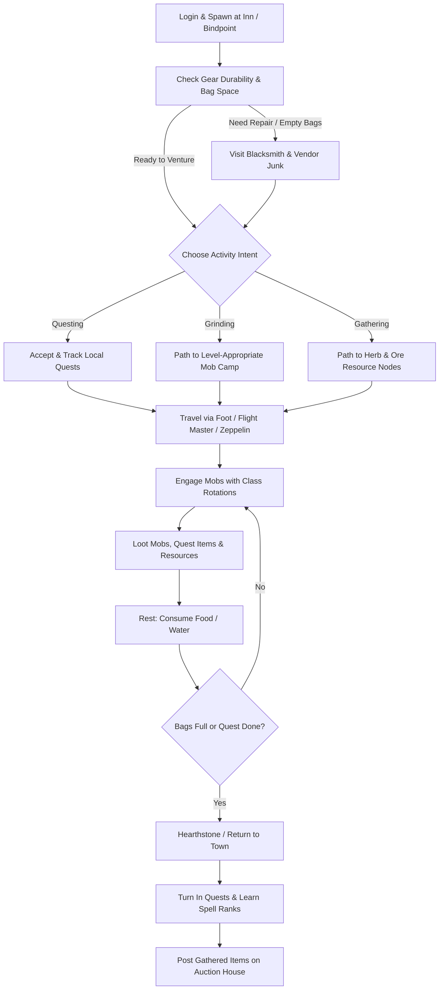
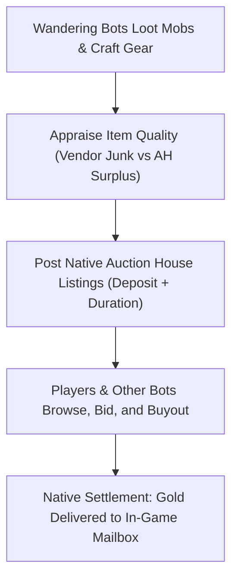

# Living World & Autonomous Bots

TortoiseBots is not limited to player-owned companions. It includes a complete **Living World** subsystem that populates your realm with autonomous bots (`RNDBOT*`). These bots explore zones, grind mobs, gather profession nodes, quest, trade on the Auction House, form parties, and create guilds—making the world feel vibrant and active like a populated MMO server.

---

## 1. Autonomous Bot Lifecycle



## 2. Wandering & Leveling Bots

Autonomous bots roam the open world, reacting dynamically to nearby players and wildlife:

| Activity | How It Works in the World |
| :--- | :--- |
| **Zone Exploration & Travel** | Bots take flight paths, ride zeppelins and boats, run along roads between towns, and use hearthstones to return to inns. |
| **Grinding & Combat** | Bots seek out level-appropriate hostile mobs, pull with class-appropriate ranged abilities, execute standard rotations, and rest with food and water between fights. |
| **Questing & Progression** | Bots pick up quests from quest givers, track quest objectives (killing specific mobs or collecting items), and turn them in for XP and gold rewards. |
| **Gathering & Professions** | Bots with Herbalism or Mining will path toward nearby herb and ore nodes in the world to harvest them. |
| **Town Life & Immersion** | In towns, bots visit class trainers to learn new spell ranks, repair yellow/red durability gear at blacksmiths, vendor junk items, and wave or say hello when passing human players. |

---

## 3. Dynamic World Level Syncing

A common issue with bot realms is having level 60 bots everywhere while you are leveling a fresh level 10 character. TortoiseBots solves this through dynamic bracket scaling:

* **`AiPlayerbot.SyncLevelWithPlayers = 1`**
  * When enabled, the server dynamically caps random bot levels to the highest online human player's level + 5 (`SyncLevelMaxAbove = 5`).
  * If you log in at level 18, the bot population scales around levels 10–23, populating Westfall, Darkshore, the Barrens, and Loch Modan.
  * As you level up into the 30s and 40s, the bot population advances into Stranglethorn Vale, Tanaris, and the Hinterlands alongside you.

---

## 4. Social Interaction: Groups & Guilds

Random bots actively participate in realm social structures:

### Party & Dungeon Invites
* **Inviting Lone Players (`RandomBotInvitePlayer = 1`):** If you are questing solo in an area, nearby random bots on matching quests or grinding in the same camp will invite you to form a party. (If you prefer to solo, turning on `/dnd` stops bot invites).
* **Bot-to-Bot Grouping (`RandomBotGroupNearby = 1`):** Bots organically group up with nearby bots to tackle difficult quest mobs, elite areas, and dungeons.

### Autonomous Guild Formation (`RandomBotFormGuild = 1`)
* Bots periodically visit guild masters in capital cities, purchase a **Guild Charter**, and collect signatures from other unguilded bots.
* Once registered, bots create custom guild names, invite fellow bots and players, and display guild names over their heads.

---

## 5. The Living Auction House Economy (`AhMarketService`)

TortoiseBots features an active, simulated player economy that prevents the Auction House from feeling like a ghost town:



* **Bot Sellers:** Bots list surplus profession mats (cloth, herbs, ore, leather), green/blue Bind-on-Equip (BoE) gear, and crafted consumables on the Auction House at realistic market prices.
* **Bot Buyers:** When bots accumulate gold, they periodically search the Auction House for gear upgrades suited to their class and spec. If an item on the AH is better than their current equipped gear, they place bids or buyout the listing.
* **Personal Settlement:** Items sold or bought by bots use native core auction mechanics. Human players receive real gold in their mailbox when a bot buys their auctions.

### Auction House Administration Commands (`.bot ah` / `.ahbot`)
Administrators can inspect and tune the synthetic market pass using in-game commands:
* `.bot ah status` — Inspect active listings, inventory counts, and market passes.
* `.bot ah reload` — Reload overrides and blacklists from the `ahbot_items` database table.
* `.bot ah rebuild [all]` — Triggers an immediate market pass (`all` expires active unbid synthetic items).
* `.bot ah item <id>` — Checks blacklist status or custom price overrides for an item.
* `.bot ah item <id> reset` — Removes custom override and restores formula pricing.
* `.bot ah item <id> <value> [chance] [min] [max]` — Overrides pricing or blacklists an item (`0 0`).

---

## 6. Automated Dungeon & Battleground Queues

### Looking-For-Trouble (LFT) Dungeon Autofill
* Config: **`AiPlayerbot.RandomBotLftEnabled = 1`**
* When human players queue in the LFT tool and sit waiting for missing roles (especially Tanks or Healers), the module checks idle random bots in the world matching that level bracket.
* Eligible bots auto-queue, accept the dungeon invite, and teleport into the instance to run the dungeon with the human group.

### Battleground Auto-Queue
* Config: **`AiPlayerbot.RandomBotBgEnabled = 1`**
* Monitors PvP queues for **Warsong Gulch (WSG)**, **Arathi Basin (AB)**, and **Alterac Valley (AV)**.
* When real players queue up, random bots queue to balance faction team sizes and launch the battleground, allowing you to play active PvP battlegrounds even on low-population private servers.

---

## 7. Recommended Living World Configuration

To enable a full living world on your server, ensure these toggles are set in `conf/aiplayerbot.conf`:

```ini
# Master bot toggle
AiPlayerbot.Enabled = 1

# Random bot population pool
AiPlayerbot.RandomBotAutologin = 1
AiPlayerbot.RandomBotAutoCreate = 1
AiPlayerbot.MinRandomBots = 60
AiPlayerbot.MaxRandomBots = 150

# Dynamic level scaling with online players
AiPlayerbot.SyncLevelWithPlayers = 1
AiPlayerbot.SyncLevelMaxAbove = 5

# Social immersion
AiPlayerbot.RandomBotInvitePlayer = 1
AiPlayerbot.RandomBotGroupNearby = 1
AiPlayerbot.RandomBotFormGuild = 1
AiPlayerbot.EnableGreet = 1

# Optional living economy & queues
AiPlayerbot.AhMarketEnabled = 1
AiPlayerbot.RandomBotLftEnabled = 1
AiPlayerbot.RandomBotBgEnabled = 1
```

## ManTech auction controller

This fork defaults to `AiPlayerbot.AhMarketUseCMaNGOS = 1`. The preserved
CMaNGOS-policy service reads `ahbot.conf` beside the main configuration
(or `AhBot.ConfigFile` in the main configuration). It uses native loot and
profession supplies, verified random-bot character ownership, bounded world-owner
work slices, native auction settlement and the existing `ahbot_items` overrides.
It does not teleport sellers or use owner GUID zero.

The `AhMarketService` behavior above applies only with
`AiPlayerbot.AhMarketUseCMaNGOS = 0`; its separate `AhMarketEnabled` switch still
applies then. The host dispatches only the selected service, and the module
market also rejects updates while CMaNGOS is selected. Restart to switch controllers.

### ManTech migration travel and Thorn Gorge (2026-09-12)

Thorn Gorge joins the existing battleground demand/queue service. Strategies use
the native battleground's objective assignment, flag ownership and GO pickup
validation. Flag delivery has priority over optional enemy pursuit; nearby
interception/local defense remains available. This behavior is scoped to Thorn.

Long ground travel attempts the existing mount action before starting movement,
subject to its combat, distance, mount availability and flag-carrier restrictions.
Failed ground routes remain failed. Native taxi IDs and cached geometry refresh
on startup; both autonomous/RPG and route taxi actions check the real source
flightmaster, endpoints, learned routes and native activation result. Failure
does not consume the leg or temporary fare credit.

Walking links no longer bridge two failed routes just because endpoints are
near, or fabricate a 20-yard portal/transport approach. A connector must pass
native pathfinding; portal activation and boarding use their existing actions.
Route preference is separate from physical movement speed. Stable party route
variation and the sustained-swim penalty remain in TravelRoutePolicy.

These ports have source/build/regression evidence, not live travel or match
acceptance. Map-owner AI scheduling and population/lifecycle migration remain
tracked by the core migration checklist.


Generic ground recovery first asks for a usable walk. Only a failed required
ground route can try the existing collision-checked ballistic jump: at most
16 direction/speed candidates per attempt, attempts spaced by five seconds,
normal player run/walk speeds and capped vertical launch speed. It rejects
casting, transport, water/flying/falling, rooted/dead and preparation states.
A landing must be walkable and leave a route making objective progress. Failed
requests are backed off and never converted to a direct ground spline.


Random-population recovery/strategy/gear maintenance now rotates fairly through
a bounded candidate slice instead of running expensive work for every bot in a
single cadence. Deferred bots keep elapsed timers. Recovery resolves the player
and module record again before subsequent work, because recovery can change
lifecycle state. Light pool accounting and timed logout are separate from this
expensive-work limit; measured runtime latency remains an acceptance gate.
