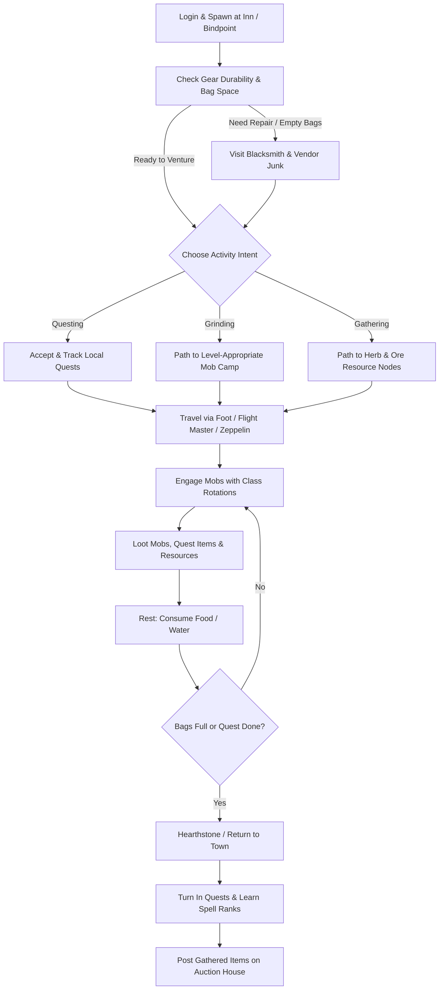
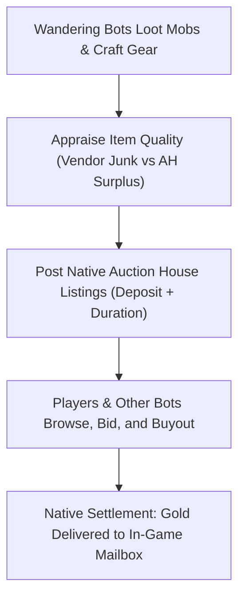

# Living World & Autonomous Bots

TortoiseBots is not limited to player-owned companions. It includes a complete **Living World** subsystem that populates your realm with autonomous bots (`RNDBOT*`). These bots explore zones, grind mobs, gather profession nodes, quest, trade on the Auction House, form parties, and create guilds—making the world feel vibrant and active like a populated MMO server.

---

## 1. Autonomous Bot Lifecycle



## 2. Wandering & Leveling Bots

Autonomous bots roam the open world, reacting dynamically to nearby players and wildlife:

| Activity | How It Works in the World |
| :--- | :--- |
| **Zone Exploration & Travel** | Bots take flight paths, ride zeppelins and boats, run along roads between towns, and use hearthstones to return to inns. |
| **Grinding & Combat** | Bots seek out level-appropriate hostile mobs, pull with class-appropriate ranged abilities, execute standard rotations, and rest with food and water between fights. |
| **Beginner Grinding (Level 1–4)** | Fresh bots in starter valleys (Valley of Trials, Camp Narache, Northshire, Coldridge, Shadowglen) target mobs up to their own level and are permitted to hunt coinless starter beasts (e.g. Mottled Boars, Scorpids, Plainstriders) while ignoring critters. |
| **Questing & Progression** | Bots pick up quests from quest givers, track quest objectives (killing specific mobs or collecting items), and turn them in for XP and gold rewards. |
| **Gathering & Professions** | Bots with Herbalism, Mining, or Skinning actively travel to resources and hunt skinning targets to gather materials for crafting and the Auction House. |
| **Town Life & Immersion** | In towns, bots visit class trainers to learn new spell ranks, repair yellow/red durability gear at blacksmiths, vendor junk items, and wave or say hello when passing human players. |

### Persistent Bot Initial Skills (`DisableRandomLevels = 1`)

For servers configured to run persistent, organically leveling bots starting at level 1 (`AiPlayerbot.DisableRandomLevels = 1`):
* **Weapon Skills:** Bots receive full class-compatible weapon proficiencies on their first login, scaled to their current level cap (e.g., 5/5 at level 1). This ensures melee and ranged attacks connect reliably instead of missing 80% of the time at 1/5 weapon skill.
* **Trade Skills:** Bots receive two class-matched primary professions (e.g. Mining + Blacksmithing/Engineering for Warriors; Skinning + Leatherworking for Rogues; Herbalism + Alchemy for Casters) plus First Aid, Cooking, and Fishing.
* **Persistence:** Seeding runs only once on initial login and is recorded in the character database, ensuring professions and skills are never re-rolled across server restarts.

---

## 3. Dynamic World Level Syncing

A common issue with bot realms is having level 60 bots everywhere while you are leveling a fresh level 10 character. TortoiseBots solves this through dynamic bracket scaling:

* **`AiPlayerbot.SyncLevelWithPlayers = 1`**
  * When enabled, the server dynamically caps random bot levels to the highest online human player's level + 5 (`SyncLevelMaxAbove = 5`).
  * If you log in at level 18, the bot population scales around levels 10–23, populating Westfall, Darkshore, the Barrens, and Loch Modan.
  * As you level up into the 30s and 40s, the bot population advances into Stranglethorn Vale, Tanaris, and the Hinterlands alongside you.

---

## 4. Social Interaction: Groups & Guilds

Random bots actively participate in realm social structures:

### Party & Dungeon Invites
* **Inviting Lone Players (`RandomBotInvitePlayer = 1`):** If you are questing solo in an area, nearby random bots on matching quests or grinding in the same camp will invite you to form a party. (If you prefer to solo, turning on `/dnd` stops bot invites).
* **Bot-to-Bot Grouping (`RandomBotGroupNearby = 1`):** Bots organically group up with nearby bots to tackle difficult quest mobs, elite areas, and dungeons.

### Autonomous Guild Formation (`RandomBotFormGuild = 1`)
* Bots periodically visit guild masters in capital cities, purchase a **Guild Charter**, and collect signatures from other unguilded bots.
* Once registered, bots create custom guild names, invite fellow bots and players, and display guild names over their heads.

---

## 5. The Living Auction House Economy (`AhMarketService`)

TortoiseBots features an active, simulated player economy that prevents the Auction House from feeling like a ghost town:



* **Bot Sellers:** Bots list surplus profession mats (cloth, herbs, ore, leather), green/blue Bind-on-Equip (BoE) gear, and crafted consumables on the Auction House at realistic market prices.
* **Bot Buyers:** When bots accumulate gold, they periodically search the Auction House for gear upgrades suited to their class and spec. If an item on the AH is better than their current equipped gear, they place bids or buyout the listing.
* **Personal Settlement:** Items sold or bought by bots use native core auction mechanics. Human players receive real gold in their mailbox when a bot buys their auctions.

### Auction House Administration Commands (`.bot ah` / `.ahbot`)
Administrators can inspect and tune the synthetic market pass using in-game commands:
* `.bot ah status` — Inspect active listings, inventory counts, and market passes.
* `.bot ah reload` — Reload overrides and blacklists from the `ahbot_items` database table.
* `.bot ah rebuild [all]` — Triggers an immediate market pass (`all` expires active unbid synthetic items).
* `.bot ah item <id>` — Checks blacklist status or custom price overrides for an item.
* `.bot ah item <id> reset` — Removes custom override and restores formula pricing.
* `.bot ah item <id> <value> [chance] [min] [max]` — Overrides pricing or blacklists an item (`0 0`).

---

## 6. Automated Dungeon & Battleground Queues

### Looking-For-Trouble (LFT) Dungeon Autofill
* Config: **`AiPlayerbot.RandomBotLftEnabled = 1`**
* When human players queue in the LFT tool and sit waiting for missing roles (especially Tanks or Healers), the module checks idle random bots in the world matching that level bracket.
* Eligible bots auto-queue, accept the dungeon invite, and teleport into the instance to run the dungeon with the human group.

### Battleground Auto-Queue
* Config: **`AiPlayerbot.RandomBotBgEnabled = 1`**
* Monitors PvP queues for **Warsong Gulch (WSG)**, **Arathi Basin (AB)**, and **Alterac Valley (AV)**.
* When real players queue up, random bots queue to balance faction team sizes and launch the battleground, allowing you to play active PvP battlegrounds even on low-population private servers.

---

## 7. Recommended Living World Configuration

To enable a full living world on your server, ensure these toggles are set in `conf/aiplayerbot.conf`:

```ini
# Master bot toggle
AiPlayerbot.Enabled = 1

# Random bot population pool
AiPlayerbot.RandomBotAutologin = 1
AiPlayerbot.RandomBotAutoCreate = 1
AiPlayerbot.MinRandomBots = 60
AiPlayerbot.MaxRandomBots = 150

# Dynamic level scaling with online players
AiPlayerbot.SyncLevelWithPlayers = 1
AiPlayerbot.SyncLevelMaxAbove = 5

# Social immersion
AiPlayerbot.RandomBotInvitePlayer = 1
AiPlayerbot.RandomBotGroupNearby = 1
AiPlayerbot.RandomBotFormGuild = 1
AiPlayerbot.EnableGreet = 1

# Optional living economy & queues
AiPlayerbot.AhMarketEnabled = 1
AiPlayerbot.RandomBotLftEnabled = 1
AiPlayerbot.RandomBotBgEnabled = 1
```

## ManTech auction controller

This fork defaults to `AiPlayerbot.AhMarketUseCMaNGOS = 1`. The preserved
CMaNGOS-policy service reads `ahbot.conf` beside the main configuration
(or `AhBot.ConfigFile` in the main configuration). It uses native loot and
profession supplies, verified random-bot character ownership, bounded world-owner
work slices, native auction settlement and the existing `ahbot_items` overrides.
It does not teleport sellers or use owner GUID zero.

The `AhMarketService` behavior above applies only with
`AiPlayerbot.AhMarketUseCMaNGOS = 0`; its separate `AhMarketEnabled` switch still
applies then. The host dispatches only the selected service, and the module
market also rejects updates while CMaNGOS is selected. Restart to switch controllers.

### ManTech migration travel and Thorn Gorge (2026-09-12)

Thorn Gorge joins the existing battleground demand/queue service. Strategies use
the native battleground's objective assignment, flag ownership and GO pickup
validation. Flag delivery has priority over optional enemy pursuit; nearby
interception/local defense remains available. This behavior is scoped to Thorn.

Long ground travel attempts the existing mount action before starting movement,
subject to its combat, distance, mount availability and flag-carrier restrictions.
Failed ground routes remain failed. Native taxi IDs and cached geometry refresh
on startup; both autonomous/RPG and route taxi actions check the real source
flightmaster, endpoints, learned routes and native activation result. Failure
does not consume the leg or temporary fare credit.

Walking links no longer bridge two failed routes just because endpoints are
near, or fabricate a 20-yard portal/transport approach. A connector must pass
native pathfinding; portal activation and boarding use their existing actions.
Route preference is separate from physical movement speed. Stable party route
variation and the sustained-swim penalty remain in TravelRoutePolicy.

These ports have source/build/regression evidence, not live travel or match
acceptance. Map-owner AI scheduling and population/lifecycle migration remain
tracked by the core migration checklist.


Generic ground recovery first asks for a usable walk. Only a failed required
ground route can try the existing collision-checked ballistic jump: at most
16 direction/speed candidates per attempt, attempts spaced by five seconds,
normal player run/walk speeds and capped vertical launch speed. It rejects
casting, transport, water/flying/falling, rooted/dead and preparation states.
A landing must be walkable and leave a route making objective progress. Failed
requests are backed off and never converted to a direct ground spline.


Random-population recovery/strategy/gear maintenance now rotates fairly through
a bounded candidate slice instead of running expensive work for every bot in a
single cadence. Deferred bots keep elapsed timers. Recovery resolves the player
and module record again before subsequent work, because recovery can change
lifecycle state. Light pool accounting and timed logout are separate from this
expensive-work limit; measured runtime latency remains an acceptance gate.


## ManTech restart and migration state

The facade persists bot event keys and trade discounts in `ai_playerbot_values`,
with absolute 64-bit expiration. Migration `20260912090000_char.sql` imports the
latest owner-zero legacy row per bot/event and records an import marker so reruns
cannot resurrect deleted new values. Existing new values win. Legacy cleanup
migrations now preserve source tables; already deleted historical rows cannot be
reconstructed. Spec, initialization and always-online keys retain their non-expiring
legacy meaning. Fresh, duplicate/nullable legacy, previously cleaned and repeated
SQL cases were exercised in isolated MariaDB 11.4.12.

### Reply catalog migration

The native world migration `20260912091000_world.sql` supplies the preserved
Tortoise reply catalog (1,937 rows) and three probability defaults. Existing replies,
translations and configured probabilities are retained, and repeated application
does not duplicate seeded rows. Optional LLM replies use a separate per-AI mailbox
and are discarded when that AI logs out. Generated donor help graphs are not seeded
by this migration.


## Installed ManTech default data

The additive native migrations supply 28 Vanilla spec weight scales, 180 stat
weights, 319 enchantment rows, 1,000 validated area levels and 54,055 named locations.
These restore the previously empty gear-scoring, enchantment and travel metadata.
Only the nine Vanilla classes are seeded; enchant spell IDs and area/map IDs were
checked against the local Turtle DBCs. Named coordinates retain the donor data;
native consumers still own terrain, faction, movement and teleport eligibility.
Travel-node/path geometry is not imported over Turtle's native route cache.

Existing keys and operator values are preserved on replay. Conflicting spec IDs
cannot receive weights intended for a different spec. Source hashes, commits and
filter counts are in `reference/mantech-datasets.json` (relative to docs).
The help seed adds 22 module-specific topics, including all nine classes, without
overwriting existing topic text or translations. Whisper `help` to browse.

World-buff regrouping stores the summon cooldown in the owning AI's manual value
context. Action instances for one bot share it, and a new login starts with fresh
state. Finishing regrouping clears the timer. This removes a process-global GUID
map; it does not yet move cross-player summons or step updates onto map threads.

Human friendship and controlled-companion presence are taken from the native
non-random population view. An autonomous bot alone no longer makes the server
look human-populated. Channel chat checks for a real network player in the named
channel; somebody online in a different channel does not count as its audience.


### Background death recovery ownership (2026-09-12)

ProcessBot no longer calls RepopAtGraveyard on every maintenance pass for a dead
character. That shim repeatedly interrupted native ghost/corpse travel. Active
ReleaseSpiritAction, ReviveFromCorpseAction and SpiritHealerAction already own
release, waiting for a human resurrection, native corpse recovery and graveyard
fallback. Background maintenance now excludes dead, grouped, taxi, BG/queue,
transferring, logging-out, human-controlled and nearby-human characters, following
the preserved ManTech ProcessBot eligibility at baseline
37aee50d6bfbf9194dd5e3c79a156d9bfcb4f569. Expired-value maintenance stays on the
world owner. Ineligible results also suppress strategy/gear maintenance for that
slice. Administrative Revive remains a separate compatibility item.

ModuleNativeMaintenanceEligibilityTest compiles the actual facade function and
checks repeated dead/ghost passes, all eligibility gates, missing AI, map-owner
rejection and successful quiet-world cache cleanup. The existing 6000-candidate
service test retains budgeting, fairness and re-resolution after lifecycle change.
No native core function or new hook was added.


### World-owned guild decision values (2026-09-12)

Guild orders and sharing currently inspect native guild notes, all online guild
members' roles and inventories, and other AI contexts. Action deferral alone
cannot protect these reads: trigger/value evaluation precedes action selection.
The existing CalculatedValue cache has no owner dispatch; copying every guild
inventory every tick would add unrelated world scanning. The module therefore
adds an explicit WorldCalculatedValue specialization for copied decision facts.
It reuses BotWorldActions and existing value intervals. World callers calculate
synchronously. Map callers return the last completed result (empty before the
first completion) and coalesce one due world refresh. They do not advance cache
time merely because a refresh was requested. Existing dependent-value intervals
and one world join can delay observing a newly assigned order.

Only guild order, share list, craft/farm/quest-reward orders and the missing
reagent item-ID vector opt in. Map travel selection caches reagent IDs for five seconds, avoiding repeated
guild-wide inventory scans. World purchase callers retain a fresh calculation. Actual purchase/item-transfer actions retain native live
eligibility checks. No live Player/Unit/Item pointer is stored in these results.
Nested guild dependencies compute synchronously on the world owner. The callback
holds names and weak value epochs; Reset/destruction cancels obsolete work, and
native actor lifetime/map stamps handle logout/reclaim/transfer. Admission
failure or discarded work remains due for retry. World queue capacity and time
budgets are unchanged; no per-tick eager guild or database scan was added.

GuildShareTarget still requires separate live receiver identity review. This
change does not enable map AI or declare the rest of the value graph safe.
The donor guild parsing, role filters, deficit and choice algorithms remain in
GuildValues.cpp. This is an independently implemented module ownership adapter;
no new native host seam or schema was required.

ModuleWorldValueTest compiles the actual cache and base value implementation; it covers last-completed facts, nested dependencies, coalescing, admission rejection, discarded work, Reset and destruction/replacement.


### Native guild item trades (2026-09-12)

Guild item sharing now creates a native trade offer and completes it through
HandleInitiateTradeOpcode, HandleBeginTradeOpcode, HandleSetTradeItemOpcode and
both native HandleAcceptTradeOpcode calls. Partial stacks use native SplitItem
in an empty validated inventory position, preserving the core's CloneItem
metadata and rejection/rollback behavior. The old manual ownership mutation,
CreateItem reconstruction and sender-only early save are removed. Native trade
retains faction, hardcore, binding, raid-item trading, bag-space, scam-prevention,
logging and persistence behavior. No native trade check or delay is bypassed.

NativeGuildTrades is a bounded module world-phase interaction owner (64 offers;
at most 8 completions/cancellations and a 4ms soft budget per update). An ordinary
map-stamped action continuation would discard a transferred request without
canceling its already-open trade, including a nearby same-map teleport. The
native player event processor also runs on maps. This service therefore uses
the existing post-map BotManager update/removal guard and checks pending offers
even when their map stamp changes, so it can cancel its own unchanged native
offer. It adds no core hook, thread, sleep or persistent parallel trade system.

Each offer carries revocable native Player identities, both map stamps, both
master GUIDs and the exact item/amount. Removed/reclaimed actors are left to
native logout cancellation; changed money/spells/items are not overwritten.
Map/ownership/guild/eligibility changes cancel only the unchanged owned offer.
Acceptance waits at least the native interval plus one second for its time_t
resolution. Completion requires the native trade to close and exact conserved
inventory deltas on both players. Shutdown cancels remaining unchanged offers.
An action success reports an offered gift; the separate completion log records
the actual transfer result. There is no success announcement before transfer.

Source: the pinned native core's TradeHandler.cpp, Player::SplitItem,
Player::RemoveFromWorld, and Item::CloneItem/CanBeTraded; guild sharing intent
comes from the active Sagiroth-derived GuildShareItemAction and GuildValues.
The service is independently implemented against native contracts. Its runtime
acceptance is pending until the new build and disposable trade fixtures pass.


### Party decision locality (2026-09-12)

Party decisions now exclude members in other map instances from nearby healing, combat assistance and line-follow positions. The group count value includes every eligible matching bot instead of returning zero at the first match.


### Remaining world services (2026-09-12)

Automatic mail checks now return a complete unrequested item message through a nearby mailbox. Requested items, auction messages and mail to hardcore senders are preserved. Mailbox rejection leaves the original message available. Native guild item transfers have passed live four-item partial and six-item whole-stack checks, including temporary guild/item cleanup, on local candidate 7ada33107b429af17e8195ad162e28a04e27433cd9373d30efb4d9bfd5165c97.


### Native party gifts (2026-09-12)

Bots share missing usable conjured food and water with party bots through native trades, offering one stack at a time. Normal trade range, faction, binding and inventory rules apply. They no longer claim receipt before the native transfer completes.


### Cross-map owner observations (2026-09-12)

A bot keeps its owner relationship across maps. Follow and quest decisions use copied owner facts refreshed in the world phase; nearby movement/consumable/enchant decisions use only actors in the same map instance. This avoids treating an owner in another instance as locally nearby.
